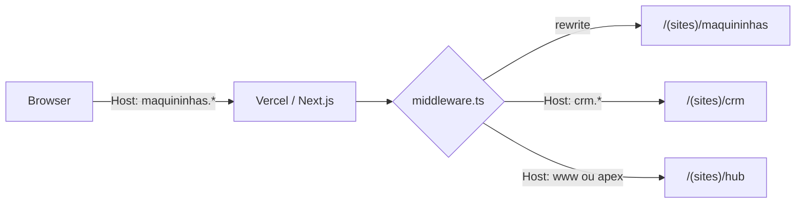

# Spec: HUB de Produtos Herocash Brasil

> **Status:** Fase 1 validada — aguardando aprovação para implementar  
> **Última atualização:** 2026-07-07

---

## Objective

Transformar o site atual (landing page única focada em maquininhas) em um **HUB de produtos** da Herocash Brasil — um ecossistema digital onde o visitante entende a empresa, navega entre soluções e converte em cada produto.

### Usuários

| Persona | Objetivo |
|---------|----------|
| Comerciante / MEI | Encontrar maquininha e plano ideal |
| Empresário em crescimento | Descobrir CRM via WhatsApp para organizar vendas |
| Visitante geral | Conhecer a Herocash, contatos e portfólio de soluções |

### User Stories

1. **Como visitante**, quero ver na home uma visão geral da empresa e dos produtos, para entender o que a Herocash oferece.
2. **Como comerciante**, quero acessar rapidamente a página de maquininhas com planos, taxas e simulador — com as mesmas informações de hoje.
3. **Como empresário**, quero conhecer o CRM Herocash (WhatsApp + atendimento + automação) e falar com um especialista.
4. **Como visitante em qualquer página**, quero uma topbar chamativa para alternar entre produtos sem perder contexto.
5. **Como usuário mobile**, quero navegar confortavelmente em telas pequenas.

### Success Criteria

- [ ] `herocashbrasil.com.br` é o HUB (não mais a landing de maquininhas)
- [ ] `maquininhas.herocashbrasil.com.br` contém **todo** o conteúdo atual de maquininhas/planos/simulador, sem perda de informação
- [ ] `crm.herocashbrasil.com.br` apresenta o CRM Herocash com estrutura inspirada na [demonstração HelenaCRM](https://www.helenacrm.com/demonstracao-helenacrm) — **sem vídeos na v1**
- [ ] Topbar de produtos visível e funcional em **todas** as páginas (exceto talvez área externa do cliente)
- [ ] Navegação 100% responsiva (mobile-first, testado em 375px / 768px / 1280px)
- [ ] Links quebrados corrigidos (`#planos` hoje aponta para seção não renderizada)
- [ ] SEO: metadata distinta por rota (`/`, `/maquininhas`, `/crm`, `/sobre`)
- [ ] Subdomínios externos (ex.: `cliente.*`) **não** são interceptados pelo middleware
- [ ] Taxas, planos, produtos e contatos vêm de **fonte única** — alterar um valor propaga para simulador, tabelas e cards

---

## Decisões Validadas (2026-07-07)

| Tópico | Decisão |
|--------|---------|
| Vídeos CRM | Não na v1 |
| WhatsApp | Mesmo número `5585987005263`; mensagens iniciais diferentes por produto |
| Nome do produto CRM | **CRM Herocash** |
| Sobre a empresa | Seção no HUB (`herocashbrasil.com.br`); `/sobre` pode permanecer como página detalhada |
| Identidade visual | Amarelo Herocash em todos os produtos |
| Produtos na topbar | Apenas 2 — Maquininhas e CRM Herocash, ambos com destaque igual |
| Cards do HUB | 2 cards grandes com imagem de fundo e links chamativos para os subdomínios |
| Arquitetura de deploy | **Um repositório, um deploy, subdomínios via middleware** |
| Subdomínios externos | Lista editável de hosts livres — middleware **não intercepta** |
| Dados dinâmicos | Fonte única em `src/data/` — taxas/planos/contatos replicam automaticamente |

---

## Arquitetura de Subdomínios (recomendada)

### Abordagem escolhida: **Single App + Middleware**

Um único projeto Next.js, um deploy (Vercel), DNS apontando todos os subdomínios para o mesmo projeto. O `middleware.ts` lê o `Host` da requisição e faz **rewrite interno** para a rota correta.

```
herocashbrasil.com.br          →  app/(sites)/hub/page.tsx
maquininhas.herocashbrasil.com.br  →  app/(sites)/maquininhas/page.tsx
crm.herocashbrasil.com.br      →  app/(sites)/crm/page.tsx
```

Cada subdomínio serve seu conteúdo na **raiz `/`** — o visitante vê `maquininhas.herocashbrasil.com.br/` e não `/maquininhas`. Isso dá sensação de site independente mantendo um único codebase.

### Por que esta abordagem?

| Abordagem | Prós | Contras | Veredito |
|-----------|------|---------|----------|
| **Middleware + 1 deploy** ✅ | Um repo, componentes compartilhados, um CI/CD, topbar/footer unificados | Exige configurar DNS + middleware | **Recomendada** |
| Path-based (`/maquininhas`) sem subdomínio | Simples | Não atende o requisito de subdomínios | ❌ |
| Monorepo com 3 apps Next.js | Isolamento total | 3 deploys, código duplicado, manutenção triplicada | ❌ Overkill |
| 3 projetos Vercel no mesmo repo | Separação de deploy | Compartilhar componentes é mais difícil | ❌ |
| Reverse proxy externo (nginx) | Flexível | Infra extra fora da Vercel | ❌ Desnecessário |

### Fluxo de requisição



### Mapeamento de hosts

```ts
// src/lib/sites.ts
export const SITES = {
  hub: {
    hosts: ["herocashbrasil.com.br", "www.herocashbrasil.com.br"],
    internalPath: "/hub",
    publicUrl: "https://herocashbrasil.com.br",
  },
  maquininhas: {
    hosts: ["maquininhas.herocashbrasil.com.br"],
    internalPath: "/maquininhas",
    publicUrl: "https://maquininhas.herocashbrasil.com.br",
  },
  crm: {
    hosts: ["crm.herocashbrasil.com.br"],
    internalPath: "/crm",
    publicUrl: "https://crm.herocashbrasil.com.br",
  },
} as const
```

### Middleware (esboço)

```ts
// src/middleware.ts
import { NextRequest, NextResponse } from "next/server"
import { getSiteFromHost, getSitePublicUrl } from "@/lib/sites"

export function middleware(request: NextRequest) {
  const host = request.headers.get("host") ?? ""
  const site = getSiteFromHost(host)
  const { pathname } = request.nextUrl

  // Subdomínio acessando path de outro site → redirect canônico
  if (pathname.startsWith("/maquininhas") && site.slug !== "maquininhas") {
    return NextResponse.redirect(`${getSitePublicUrl("maquininhas")}${pathname.replace("/maquininhas", "") || "/"}`)
  }
  // ... idem para /crm, /hub

  // Raiz do subdomínio → rewrite para rota interna
  if (pathname === "/" && site.slug !== "hub") {
    return NextResponse.rewrite(new URL(site.internalPath, request.url))
  }

export function middleware(request: NextRequest) {
  const host = normalizeHost(request.headers.get("host") ?? "")

  // ⚠️ PRIMEIRA verificação — hosts externos nunca passam pelo roteamento
  if (isExternalHost(host)) {
    return NextResponse.next() // Vercel encaminha ao projeto/deploy correto
  }

  const site = getSiteFromHost(host)
  const { pathname } = request.nextUrl
  // ... resto do roteamento
}
```

### Domínios livres (subdomínios externos)

Subdomínios como [`cliente.herocashbrasil.com.br`](https://cliente.herocashbrasil.com.br/login?navigateTo=%2F) apontam para **projetos/deploys separados** na Vercel (ou outro host). O middleware deste projeto **não deve interceptá-los**.

Lista centralizada e facilmente editável em `src/config/domains.ts`:

```ts
// src/config/domains.ts
// ─────────────────────────────────────────────────────────
// DOMÍNIOS LIVRES — subdomínios gerenciados FORA deste projeto.
// O middleware ignora qualquer host que case com esta lista.
// Para adicionar um novo subdomínio externo, basta incluir aqui.
// ─────────────────────────────────────────────────────────

/** Subdomínios (sem domínio raiz) que pertencem a outros projetos */
export const EXTERNAL_SUBDOMAINS = [
  "cliente",   // https://cliente.herocashbrasil.com.br — área do cliente
  // "parceiro",  // exemplo futuro
  // "api",       // exemplo futuro
] as const

/** Domínio raiz da marca — usado para montar hosts completos */
export const ROOT_DOMAIN = "herocashbrasil.com.br"

/** Hosts externos completos (gerado + overrides manuais se necessário) */
export const EXTERNAL_HOSTS: readonly string[] = [
  ...EXTERNAL_SUBDOMAINS.map((sub) => `${sub}.${ROOT_DOMAIN}`),
  // Overrides pontuais (domínios que não seguem o padrão sub.ROOT):
  // "outro-dominio.com.br",
]

export function normalizeHost(host: string): string {
  return host.split(":")[0].toLowerCase()
}

export function isExternalHost(host: string): boolean {
  const normalized = normalizeHost(host)
  return EXTERNAL_HOSTS.some(
    (external) => normalized === external || normalized.endsWith(`.${external}`)
  )
}
```

**Comportamento:**

| Host | Middleware deste projeto |
|------|--------------------------|
| `cliente.herocashbrasil.com.br` | `NextResponse.next()` imediato — sem rewrite, sem redirect |
| `maquininhas.herocashbrasil.com.br` | Roteamento normal → site maquininhas |
| `herocashbrasil.com.br` | Roteamento normal → HUB |

**Na Vercel:** cada subdomínio externo é um **projeto separado** com seu próprio deploy. O DNS aponta `cliente.*` para o projeto da área do cliente; `maquininhas.*` e `crm.*` para este projeto. Como ambos podem compartilhar o domínio raiz, a ordem de verificação no middleware é crítica: **externos primeiro, sites depois**.

**Links no site:** a topbar e o footer referenciam `cliente.herocashbrasil.com.br` via `src/data/company.ts` (não hardcoded nos componentes).

```ts
// src/data/company.ts
export const company = {
  name: "Herocash Brasil",
  phone: "(88) 99640-3238",
  email: "contato@herocashbrasil.com",
  whatsapp: "5585987005263",
  urls: {
    clientArea: "https://cliente.herocashbrasil.com.br",
    hub: "https://herocashbrasil.com.br",
    instagram: "https://instagram.com/herocashbrasil",
    // ...
  },
} as const
```

### Redirects canônicos (SEO)

Evitar conteúdo duplicado entre domínio principal e subdomínios:

| Acesso | Ação |
|--------|------|
| `herocashbrasil.com.br/maquininhas` | 301 → `maquininhas.herocashbrasil.com.br` |
| `herocashbrasil.com.br/crm` | 301 → `crm.herocashbrasil.com.br` |
| `herocashbrasil.com.br/#maquininhas` | 301 → `maquininhas.herocashbrasil.com.br` |
| `www.herocashbrasil.com.br` | 301 → `herocashbrasil.com.br` (opcional) |

### DNS + Vercel

No painel Vercel do projeto, adicionar domínios:

```
herocashbrasil.com.br
www.herocashbrasil.com.br
maquininhas.herocashbrasil.com.br
crm.herocashbrasil.com.br
```

No DNS (Registro.br ou Cloudflare):

```
A/CNAME  @              → Vercel
CNAME    www            → cname.vercel-dns.com
CNAME    maquininhas    → cname.vercel-dns.com
CNAME    crm            → cname.vercel-dns.com
```

### Desenvolvimento local

Opções (da mais simples à mais fiel):

1. **Paths locais (recomendado para dev diário):** `localhost:3000` = hub, `/maquininhas`, `/crm` — middleware desabilitado ou com fallback por path quando `host` é `localhost`.
2. **`*.localhost`:** Chrome resolve `maquininhas.localhost:3000` nativamente.
3. **`/etc/hosts`:** `127.0.0.1 maquininhas.herocashbrasil.com.br` para testar subdomínios reais.

```ts
// Em desenvolvimento, fallback por path:
if (host.startsWith("localhost")) {
  if (pathname.startsWith("/maquininhas")) return "maquininhas"
  if (pathname.startsWith("/crm")) return "crm"
  return "hub"
}
```

### Links entre sites

Topbar, cards do HUB e footer usam **URLs absolutas** dos subdomínios (não paths relativos):

```ts
// src/data/hub-products.ts
export const hubProducts = [
  {
    name: "Maquininhas",
    href: "https://maquininhas.herocashbrasil.com.br",
    whatsappMessage: "Olá! Tenho interesse nas maquininhas Herocash.",
    backgroundImage: "/images/hub/maquininhas-card.jpg",
  },
  {
    name: "CRM Herocash",
    href: "https://crm.herocashbrasil.com.br",
    whatsappMessage: "Olá! Quero conhecer o CRM Herocash.",
    backgroundImage: "/images/hub/crm-card.jpg",
  },
]
```

### WhatsApp por produto

Mesmo número, mensagem diferente:

```
Maquininhas: https://wa.me/5585987005263?text=Olá!%20Tenho%20interesse%20nas%20maquininhas%20Herocash.
CRM:         https://wa.me/5585987005263?text=Olá!%20Quero%20conhecer%20o%20CRM%20Herocash.
```

---

## Tech Stack

| Camada | Tecnologia |
|--------|------------|
| Framework | Next.js 16 (App Router) |
| UI | React 19, TypeScript |
| Estilo | Tailwind CSS 3, shadcn/ui (Radix) |
| Fontes | Geist Sans / Geist Mono |
| Analytics | Vercel Analytics |
| Deploy | Vercel (presumido) |

Sem novas dependências previstas na v1.

---

## Commands

```bash
# Desenvolvimento
npm run dev

# Build de produção
npm run build

# Lint
npm run lint

# Servidor de produção local
npm run start
```

---

## Project Structure

```
src/
├── middleware.ts               # Roteamento por subdomínio
├── lib/
│   ├── sites.ts                # Config de hosts, URLs públicas, site atual
│   └── utils.ts
├── app/
│   ├── layout.tsx              # Shell global: ProductTopbar + Navbar + Footer
│   ├── (sites)/
│   │   ├── hub/
│   │   │   └── page.tsx        # herocashbrasil.com.br
│   │   ├── maquininhas/
│   │   │   └── page.tsx        # maquininhas.herocashbrasil.com.br
│   │   └── crm/
│   │       └── page.tsx        # crm.herocashbrasil.com.br
│   └── sobre/
│       └── page.tsx            # herocashbrasil.com.br/sobre (institucional detalhado)
├── components/
│   ├── hub/
│   │   ├── product-topbar.tsx  # Links absolutos para subdomínios
│   │   ├── hub-hero.tsx
│   │   ├── product-cards.tsx   # 2 cards full-bleed com imagem de fundo
│   │   ├── about-section.tsx   # Sobre a empresa (só no HUB)
│   │   └── contact-section.tsx
│   ├── crm/                    # Seções da página CRM (sem vídeos v1)
│   └── [componentes existentes de maquininhas...]
├── data/
│   ├── products.ts             # Maquininhas (existente)
│   ├── plans.ts                # Planos (existente)
│   ├── hub-products.ts         # Registro central + URLs de subdomínio
│   └── crm-content.ts          # Copy e features do CRM Herocash
```

---

## Information Architecture

```
┌─────────────────────────────────────────────────────────────┐
│  PRODUCT TOPBAR  (amarelo/preto — destaque, sempre visível) │
│  [ Herocash HUB ]  [ Maquininhas ]  [ CRM WhatsApp ]        │
├─────────────────────────────────────────────────────────────┤
│  NAVBAR  (logo, links contextuais, Área do cliente)        │
├─────────────────────────────────────────────────────────────┤
│  CONTEÚDO DA PÁGINA                                         │
├─────────────────────────────────────────────────────────────┤
│  FOOTER  (empresa, produtos, legal, redes, apps)            │
└─────────────────────────────────────────────────────────────┘
```

### Hosts públicos

| Host | Papel | Conteúdo |
|------|-------|----------|
| `herocashbrasil.com.br` | HUB | Hero institucional, 2 product cards (imagem de fundo + CTA), sobre a empresa, stats, contato |
| `maquininhas.herocashbrasil.com.br` | Produto | Migração integral do site atual de maquininhas |
| `crm.herocashbrasil.com.br` | Produto | CRM Herocash (sem vídeos v1) |
| `herocashbrasil.com.br/sobre` | Institucional | Página detalhada existente |

### Página HUB — Product Cards (destaque principal)

Dois cards lado a lado (empilhados no mobile), ocupando área generosa:

```
┌────────────────────────┐  ┌────────────────────────┐
│  [imagem de fundo]     │  │  [imagem de fundo]     │
│  Maquininhas           │  │  CRM Herocash          │
│  Taxas competitivas... │  │  Vendas no WhatsApp... │
│  [ Conhecer solução →] │  │  [ Conhecer solução →] │
└────────────────────────┘  └────────────────────────┘
         ↓ link absoluto            ↓ link absoluto
   maquininhas.*.com.br         crm.*.com.br
```

- Imagem de fundo com overlay escuro para legibilidade
- Hover: leve zoom na imagem + destaque no botão amarelo
- Mobile: cards full-width, altura mínima ~280px

### Página `/maquininhas` — Migração do atual

Mover **sem alterar conteúdo** as seções de `src/app/page.tsx`:

1. HeroSection
2. PaymentMethods
3. BenefitsSection
4. StatsSection
5. PricingTable (`#tabela-planos`)
6. SalesCalculator (`#simulador`)
7. **PricingPlans** (`#planos`) — **incluir na renderização** (corrige link quebrado)
8. ProductComparison (`#maquininhas`)
9. TestimonialsSection
10. MosaicGrid
11. FeaturesSection
12. AboutSection (opcional — pode ficar só no HUB e `/sobre`)

Navbar contextual nesta rota: Maquininhas | Planos | Simulador | Sobre (âncoras internas).

### Página `/crm` — Novo produto

Inspirada na [demonstração HelenaCRM](https://www.helenacrm.com/demonstracao-helenacrm), adaptada para marca Herocash:

| Seção | Referência Helena | Adaptação Herocash |
|-------|-------------------|-------------------|
| Hero | "Tenha o seu próprio CRM via WhatsApp" | Hero com proposta de valor + CTA WhatsApp |
| Agente de IA | Vídeo + "Falar com especialista" | Feature block + CTA |
| Central de Atendimento | Organização de conversas | Feature block |
| CRM Conversacional | Pipeline de vendas no WhatsApp | Feature block |
| Chatbot | Resposta 24h | Feature block |
| Grid de benefícios | Múltiplos atendentes, disparo, automações... | Ícones + bullets |
| CTA final | "Ver demonstração" | WhatsApp com mensagem pré-preenchida |
| Vídeos demo | Embeds de demonstração | **Não na v1** — seção omitida ou substituída por ilustração estática |

**Nota:** Não replicar formulários Webflow da Helena — CTAs via WhatsApp, padrão do site atual.

### Product Topbar — Componente-chave

Barra **acima** do Navbar, visualmente distinta:

```
┌──────────────────────────────────────────────────────────┐
│  Nossas soluções:  [ Maquininhas ]  [ CRM Herocash ]    │
└──────────────────────────────────────────────────────────┘
```

**Comportamento:**
- Links **absolutos** para subdomínios (`https://maquininhas...`, `https://crm...`)
- Fundo amarelo Herocash (`yellow-400`)
- Produto ativo destacado conforme host atual
- Mobile: scroll horizontal com os 2 produtos em destaque igual
- Sticky junto ao Navbar

**Code Style (exemplo):**

```tsx
// src/data/hub-products.ts
export const hubProducts = [
  {
    slug: "maquininhas",
    name: "Maquininhas",
    shortName: "Maquininhas",
    href: "/maquininhas",
    icon: CreditCard,
    description: "Taxas competitivas e recebimento rápido",
    accent: "yellow",
  },
  {
    slug: "crm",
    name: "CRM WhatsApp",
    shortName: "CRM",
    href: "/crm",
    icon: MessageSquare,
    description: "Atendimento, vendas e automação no WhatsApp",
    accent: "black",
  },
] as const
```

```tsx
// Padrão de seção (reutilizar convenção existente)
<section id="planos" className="py-16 md:py-24">
  <div className="container mx-auto px-4 max-w-[1350px]">
    {/* conteúdo */}
  </div>
</section>
```

**Convenções:**
- Tailwind utility-first, sem CSS modules
- Componentes de página em `components/[produto]/`
- Dados estáticos em `src/data/`
- CTAs WhatsApp: `https://wa.me/5585987005263?text=...`
- Responsivo: mobile-first (`md:`, `lg:` breakpoints)
- Unificar nomenclatura de marca: **Herocash Brasil** (corrigir variações Hero Cash / HeroCash)

---

## Arquitetura de Dados (fonte única)

### Problema atual

Os mesmos dados estão **duplicados** em vários arquivos:

| Dado | Onde aparece hoje | Problema |
|------|-------------------|----------|
| Taxas Visa por plano/modalidade | `paymentRates`, `installmentOptions` | Valores copiados — risco de divergência |
| Taxas resumidas (débito, crédito, 12x) | `planRates` | Derivável de `paymentRates`, mas mantido separado |
| Lista de planos (nome, cor) | `pricing-table.tsx` inline | Hardcoded no componente |
| WhatsApp `5585987005263` | 12+ componentes | Alterar número exige busca em todo o repo |
| Mensagens WhatsApp | Cada componente | Sem padrão por produto/contexto |
| URLs externas (cliente, redes) | footer, navbar | Espalhadas |

### Princípio: editar uma vez, refletir em todo lugar

```
src/data/                    ← ÚNICA fonte de verdade (editar aqui)
    │
    ├── company.ts           → contatos, URLs, WhatsApp base
    ├── plans/
    │   ├── rates.ts         → taxas canônicas (números brutos)
    │   ├── definitions.ts   → metadados dos planos (nome, cor, tagline)
    │   └── index.ts         → exports + dados derivados
    ├── products.ts          → maquininhas (preços de hardware)
    ├── hub-products.ts      → produtos do HUB (referencia company + URLs)
    └── crm-content.ts       → copy do CRM

src/lib/
    ├── format.ts            → formatRate(3.21) → "3,21%"
    ├── whatsapp.ts          → buildWhatsAppUrl(messageKey | string)
    └── plans.ts             → getInstallmentOptions(), getPlanRates() — derivados
```

### Fonte canônica de taxas

`paymentRates` em `plans.ts` passa a ser a **única** matriz de taxas numéricas. Tudo mais é **derivado**:

```ts
// src/data/plans/rates.ts — EDITAR APENAS AQUI para mudar taxas
export const RATES = {
  visa: [
    { modalidade: "PIX", taxa: { HERO: 0.56, ON: 0.56, PREMIUM: 0.56, BASIC: 0.56, ECONOMICO: 0.50 } },
    { modalidade: "Débito", taxa: { HERO: 1.45, ON: 1.45, /* ... */ } },
    // ...
  ],
  elo: [ /* ... */ ],
  hiper: [ /* ... */ ],
} as const

// src/lib/plans.ts — NÃO editar manualmente
export function getInstallmentOptions() {
  // Deriva installmentOptions a partir de RATES.visa + comparativo
}

export function getPlanRates() {
  // Deriva planRates (débito, crédito à vista, 12x) a partir de RATES.visa
}

export function getRate(plan: PlanId, modalidade: string, card: CardId = "visa"): number {
  // Lookup único usado por simulador E tabela
}
```

**Consumidores após refatoração:**

| Componente | Importa de |
|------------|------------|
| `calculator.tsx` (simulador) | `getInstallmentOptions()` |
| `pricing-table.tsx` | `PLAN_DEFINITIONS` + `getInstallmentOptions()` |
| `pricing-plans.tsx` | `getPlanRates()` + `paymentRates` (alias de RATES) |
| `product-comparison.tsx` | `products` de `products.ts` |

### Dados da empresa e contato

```ts
// src/data/company.ts
export const company = {
  whatsapp: "5585987005263",
  phone: "(88) 99640-3238",
  email: "contato@herocashbrasil.com",
  urls: {
    clientArea: "https://cliente.herocashbrasil.com.br",
    appStore: "https://apps.apple.com/br/app/hero-cash-brasil/id6749166029",
    playStore: "https://play.google.com/store/apps/details?id=app.herocash.rndlrsrt",
    // redes sociais...
  },
  whatsappMessages: {
    maquininhas: "Olá! Tenho interesse nas maquininhas Herocash.",
    crm: "Olá! Quero conhecer o CRM Herocash.",
    plano: (name: string) => `Olá, gostaria de saber mais sobre o plano ${name}!`,
    simulador: "Olá, gostaria de saber mais sobre as taxas e planos da Herocash.",
    default: "Olá! Gostaria de mais informações sobre a Herocash Brasil.",
  },
} as const
```

```ts
// src/lib/whatsapp.ts
import { company } from "@/data/company"

export function buildWhatsAppUrl(
  message: string | keyof typeof company.whatsappMessages,
  params?: Record<string, string>
): string {
  const text = typeof message === "string" && message in company.whatsappMessages
    ? company.whatsappMessages[message as keyof typeof company.whatsappMessages]
    : typeof message === "function" ? message : message
  // ...
  return `https://wa.me/${company.whatsapp}?text=${encodeURIComponent(resolved)}`
}
```

**Regra:** nenhum componente declara `5585987005263` ou URLs de cliente/redes diretamente.

### Definições de planos (metadados)

```ts
// src/data/plans/definitions.ts
export const PLAN_DEFINITIONS = [
  { id: "BASIC", name: "Basic", displayName: "Basic", color: "bg-slate-400", tagline: "..." },
  { id: "HERO", name: "Hero", displayName: "Hero", color: "bg-primary", tagline: "Recebimento na hora" },
  { id: "ON", name: "On", displayName: "On", color: "bg-emerald-500", tagline: "Recebimento em 1 dia" },
  { id: "PREMIUM", name: "Prime", displayName: "Prime", color: "bg-blue-500", tagline: "..." },
  { id: "ECONOMICO", name: "Econômico", displayName: "Econômico", color: "bg-purple-500", tagline: "..." },
] as const
```

Usado por: `pricing-table`, `pricing-plans`, `product-comparison`, `calculator`.

### Comparativo do simulador (exceção)

As taxas de concorrentes (`brother`, `infinitepay` em `installmentOptions`) são **dados de mercado**, não taxas Herocash. Permanecem em arquivo separado `src/data/plans/competitors.ts` e são mesclados na derivação — assim, alterar taxa Herocash não exige tocar no comparativo.

### Checklist de consolidação na implementação

- [ ] Criar `src/config/domains.ts` com `EXTERNAL_SUBDOMAINS`
- [ ] Criar `src/data/company.ts`
- [ ] Criar `src/lib/whatsapp.ts`
- [ ] Refatorar `plans.ts` → `plans/rates.ts` + derivados em `lib/plans.ts`
- [ ] Extrair `PLAN_DEFINITIONS` e remover array inline de `pricing-table.tsx`
- [ ] Substituir todos os `whatsappNumber` hardcoded por `buildWhatsAppUrl()`
- [ ] `hub-products.ts` referencia `company.urls` e `company.whatsappMessages`

---

## Testing Strategy

| Nível | Abordagem |
|-------|-----------|
| Manual | Checklist responsivo (375 / 768 / 1280px) |
| Build | `npm run build` — sem erros de tipo ou rota |
| Lint | `npm run lint` |
| Links | Verificar todos os hrefs (âncoras, rotas, externos) |
| SEO | Inspecionar `<title>` e `<meta description>` por rota |

**Sem testes automatizados hoje** — não adicionar framework de teste na v1, salvo solicitação.

---

## Boundaries

### Always
- Manter todas as informações atuais de maquininhas/planos/taxas
- Responsividade em todas as páginas e componentes novos
- Product Topbar visível em todas as rotas internas
- CTAs de conversão via WhatsApp (padrão existente)
- Rodar `npm run build` antes de considerar tarefa concluída

### Ask first
- Adicionar dependências (ex.: player de vídeo, animações)
- Alterar números de WhatsApp ou copy institucional
- Integrar formulários de captura de lead (além de WhatsApp)
- Mudanças em PDFs de planos ou dados de taxas
- Redirects de URLs antigas (`/#maquininhas` → `/maquininhas`)

### Never
- Remover seções de maquininhas sem aprovação
- Commitar secrets ou `.env`
- Quebrar links da Área do Cliente (`cliente.herocashbrasil.com.br`)
- Copiar assets/marca da HelenaCRM (apenas estrutura e tipo de conteúdo)

---

## Implementation Plan (Fase 2 — preview)

> Sujeito a aprovação da spec. Não implementar antes da revisão.

### Ordem sugerida

```
1. src/config/domains.ts + src/lib/sites.ts (hosts, externos, URLs)
2. src/data/company.ts + src/lib/whatsapp.ts (contatos centralizados)
3. Consolidar taxas/planos (plans/rates.ts + derivados)
4. middleware.ts (externos primeiro → roteamento por subdomínio)
5. Layout global (ProductTopbar + Footer unificado)
6. (sites)/maquininhas — migrar conteúdo atual
7. (sites)/hub — novo HUB com product cards
8. (sites)/crm — CRM Herocash (sem vídeos)
9. Navbar contextual + remover hardcodes nos componentes
10. DNS/Vercel + QA responsivo + build
```

### Riscos

| Risco | Mitigação |
|-------|-----------|
| Bookmarks em `/#maquininhas` quebram | Redirects no `next.config.ts` ou middleware |
| Topbar + Navbar ocupam muito espaço no mobile | Topbar compacta (só ícones) abaixo de 640px |
| Conteúdo CRM sem vídeos reais | Placeholders + flag em `crm-content.ts` |
| `layout.tsx` com check `typeof window` | Remover durante refatoração do layout |

---

## Tasks (Fase 3 — preview)

- [ ] **T0:** Config de domínios + dados centralizados
  - Acceptance: `domains.ts`, `company.ts`, taxas em fonte única, `buildWhatsAppUrl()` funcionando
  - Verify: Alterar uma taxa em `rates.ts` → simulador e tabela refletem; `cliente.*` na lista de externos
  - Files: `src/config/domains.ts`, `src/data/company.ts`, `src/data/plans/*`, `src/lib/whatsapp.ts`, `src/lib/plans.ts`

- [ ] **T1:** Criar `sites.ts`, `hub-products.ts` e `ProductTopbar`
  - Acceptance: Topbar renderiza produtos, destaca rota ativa, responsiva
  - Verify: `npm run dev`, testar em mobile
  - Files: `hub-products.ts`, `product-topbar.tsx`, `layout.tsx`

- [ ] **T2:** Migrar conteúdo para `/maquininhas`
  - Acceptance: Paridade com homepage atual + PricingPlans renderizado
  - Verify: Comparar seção a seção com produção atual
  - Files: `app/maquininhas/page.tsx`, `app/page.tsx`

- [ ] **T3:** Criar homepage HUB em `/`
  - Acceptance: Hero, product cards, stats, contato
  - Verify: Navegação para `/maquininhas` e `/crm`
  - Files: `app/page.tsx`, `components/hub/*`

- [ ] **T4:** Criar página `/crm`
  - Acceptance: Todas as seções CRM com CTAs WhatsApp
  - Verify: Visual em desktop e mobile
  - Files: `app/crm/page.tsx`, `data/crm-content.ts`, `components/crm/*`

- [ ] **T5:** Atualizar Navbar e Footer
  - Acceptance: Links corretos por rota, lista todos os produtos
  - Verify: Clicar todos os links
  - Files: `navbar.tsx`, `footer.tsx`

- [ ] **T6:** SEO, redirects e QA final
  - Acceptance: Metadata por rota, build limpo, links sem 404
  - Verify: `npm run build && npm run lint`
  - Files: `layout.tsx`, `next.config.ts`, metadata em cada page

---

## Open Questions (resolvidas)

Todas as questões abertas foram respondidas em **Decisões Validadas** e **Arquitetura de Subdomínios**.

Pendente apenas:
- **PricingPlans:** incluir na migração de maquininhas (corrige `#planos` quebrado) — assumir **sim** salvo objeção
- **Redirects de âncoras antigas:** `/#maquininhas` → `maquininhas.herocashbrasil.com.br` — assumir **sim**

---

## Wireframe ASCII (referência)

### HUB (`/`)

```
┌─────────────────────────────────────────┐
│ TOPBAR: [Maquininhas] [CRM WhatsApp]    │
├─────────────────────────────────────────┤
│ NAVBAR: Logo | Sobre | Área do cliente  │
├─────────────────────────────────────────┤
│                                         │
│   Soluções para impulsionar             │
│   o seu negócio                         │
│         [Conheça nossos produtos]       │
│                                         │
├─────────────────────────────────────────┤
│  ┌─────────────┐  ┌─────────────┐      │
│  │ Maquininhas │  │ CRM WhatsApp│      │
│  │ Taxas baixas│  │ Vendas + IA │      │
│  │  [Saiba +]  │  │  [Saiba +]  │      │
│  └─────────────┘  └─────────────┘      │
├─────────────────────────────────────────┤
│  +2,5 bi  |  +4.050 clientes  |  ...   │
├─────────────────────────────────────────┤
│  Sobre a Herocash (resumo)              │
├─────────────────────────────────────────┤
│  Contato: WhatsApp | Tel | Email        │
├─────────────────────────────────────────┤
│  FOOTER                                 │
└─────────────────────────────────────────┘
```

### Topbar mobile

```
┌──────────────────────────┐
│ Nossas soluções          │
│ ◀ [💳 Maq.] [💬 CRM] ▶  │  ← scroll horizontal
└──────────────────────────┘
```
